#### [<Back](./README.md)

# Morbidostat hardware components

- [1. Fluidics](#p1)
  * [1.1 Detailed tubing description](#p11)
    * [1.1.1	Media bottles with the connection lines](#p11)
    * [1.1.2 Distribution lines](#p112)
    * [1.1.3 Reactor tubing and reactor](#p113)
    * [1.1.4 Waste lines](#p114)
- [2. Mechanics](#p2)
  * [2.1 Detailed mechanical parts description](#p21)
- [3. Optics](#p3)
  * [3.1 Detailed optics description](#p31)
- [4. Electrical schemes](#p4)
- [5. 3D-printing](#p5)
  * [5.1 STL files](#p51)
- [6. Assembled morbidostat](#p6)

## 1. Fluidics
Morbidostat has five types of the tubing parts:
1.	**Media bottles with the connection lines** – store drug-containing and fresh media and connect bottles to the pumps.
2.	**Distribution lines** – distribute media among six reactors. Distribution is controlled by peristaltic pumps and valves. Valve simultaneously close or open both tubes containing fresh and drug media. One valve works for one reactor – six valves total. For the dilution the reactors valve opens and one of the pump controlling fresh or drug-containing media start operating.
3.	**Reactor input tubing** – aeration and dilution media introduction. We united air and media input tubings to allow air to make a dry space between fresh media and culturing media. It was made to avoid backflow of the cultured bacteria to the sterile media bottles. This tubing connected to the needle that has its blunt end in the culturing media to introduce bubbling that increases an aeration.
4.	**Reactor** – glass culture tube. Has three ports: input, sampling and waste. In all three ports blunt needles are inserted into the septa. OD in the reactor is measured by laser that is located in the tube rack. To introduce mixing a small stirring motor with the magnets rotates the bar in the tube.
5.	**Waste line** – open line which leads to the bottle with sodium azide. Waste is removed from the reactor by the air pressure. The line has a check valve that prevents backflow of the waste media from the tubing to the reactor.

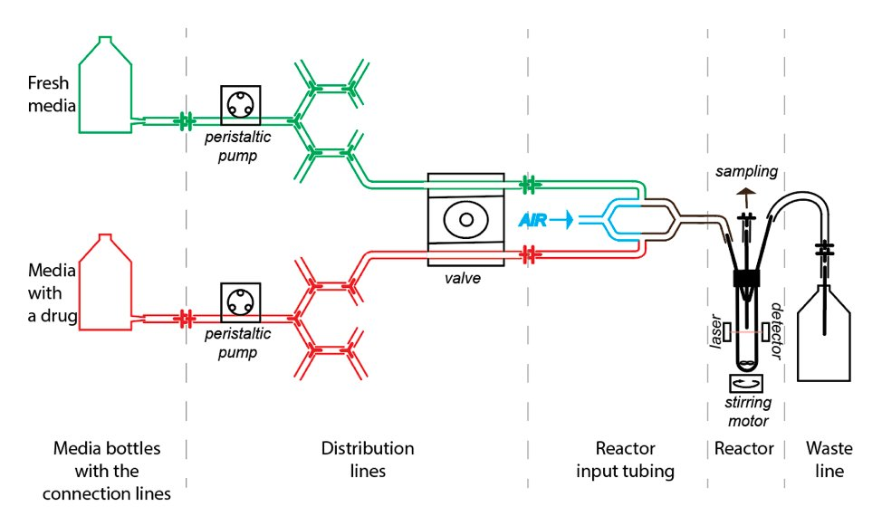 
**Figure 1.** General scheme of the morbidostat tubing. Tubing colors:  
  *green* – fresh media,  *red* – drug-containing media,  *blue* – air.

### 1.1 Detailed tubing description
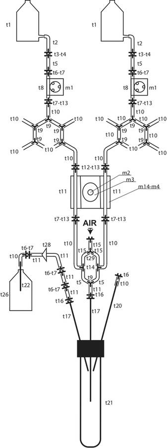 
**Figure 3.** Detailed tubing scheme.  
The part numbers are indicated according the supplementary parts specification table.

#### 1.1.1	Media bottles with the connection lines
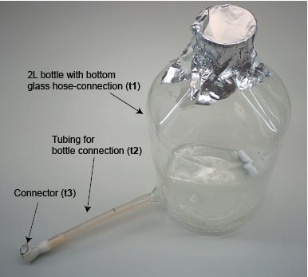 
**Figure 3.** Media bottle with tubing.  
Alpha-numeric parts numbers in parenthesis here and further identify components in the parts specification table.

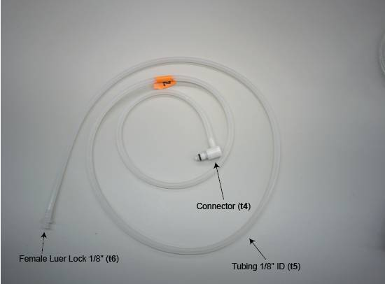 
**Figure 4.** Connection line.

#### 1.1.2 Distribution lines

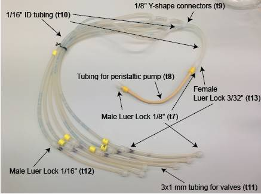 
**Figure 5.** Fresh media distribution line.

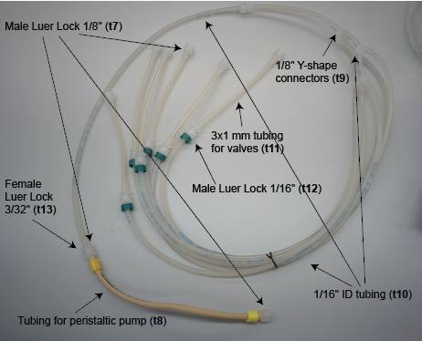 
**Figure 6.** Drug-containing media distribution line. Tubing scheme is the same as for the line on figure 4 but has an additional elongation segment.

#### 1.1.3 Reactor tubing and reactor

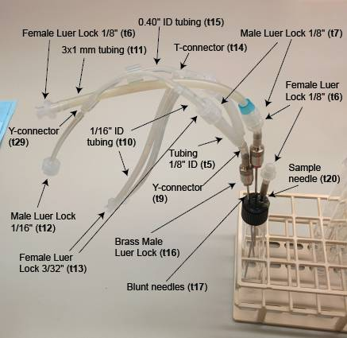 
**Figure 7.** Reactor and reactor tubing.

#### 1.1.4 Waste lines

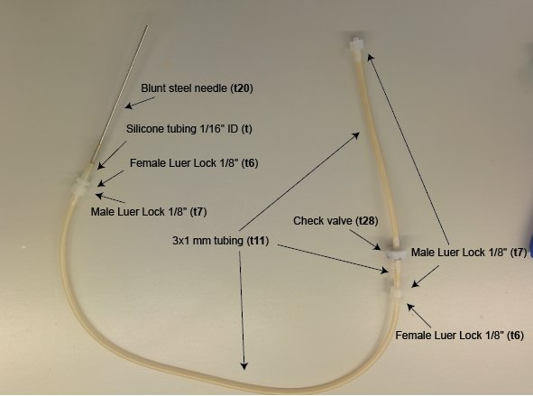 
**Figure 8.** Waste line.

## 2. Mechanics

Morbidostat contains several mechanical parts:
1. Pinch valves that restrict flow of liquid to desired tube;
2. Two pumps for fresh and drug-containing media;
3. Step motors for stirring magnetic bars in the reactors.

### 2.1 Detailed mechanical parts description

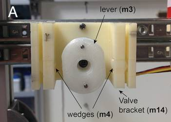 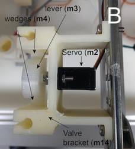 
**Figure 9.** Pinch valve for restricting media flow. A – front view; B – top view. Distribution lines are inserted to the channels on the sides. Flow is restricted by servo motors that push wedges that clamp tubing. Bracket, lever and wedges are 3D-printed. The STL files with models could be found in the `3D_printing` folder.

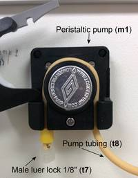 
**Figure 10.** Peristaltic pump for media.

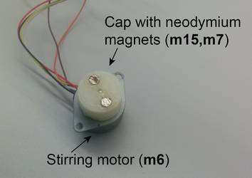 
**Figure 11.** Stirring motor with neodymium magnets. STL file for the magnets holders could be found in the `3D_printing` folder.

## 3. Optics
Correct work of the morbidostat relies on the reliable OD measurements. For this we measure intensity of the laser beam that goes through the culture. Use of the round culture tubes as the reactors brings a problem of lens effect when laser beam moves aside of the detector.
To prevent this, we are using:  
1. Nylon O-rings to stabilize the reactor at one position;
2. Set screws and nylon gasket to set the laser position. Set screw adjusted to move laser diode inside the gasket and set its position to be aligned with diode when the reactor is set.

To build Photodiode Voltage output to OD calibration curve we are using barium sulfate calibration standards.

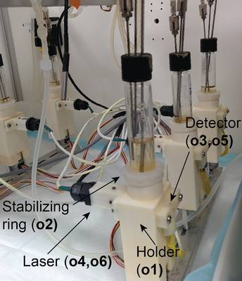 
**Figure 12.** Tube holders with lasers and photodetectors installed.

### 3.1 Detailed optics description
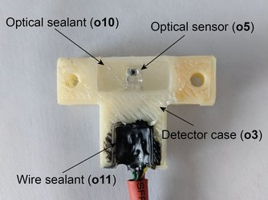 
**Figure 13.** Photodetector. STL file for the photodetector case could be found in the `3D_printing` folder.

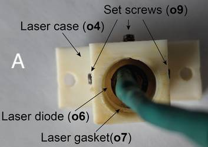 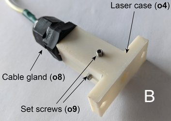 
**Figure 14.** Laser. A. Back view, B. View from above. STL files for the laser case and gasket could be found in the `3D_printing` folder.

## 4. Electrical schemes

Electric scheme consists of a few main components:
1.	Power supplies
2.	Mega 2560 Arduino control boards
3.	Two custom made wiring boards
4.	Valve servo motors control board
All morbidostat elements and logic except the agitation are controlled by Arduino 1 board. Arduino 2 board controls only stirring motors.

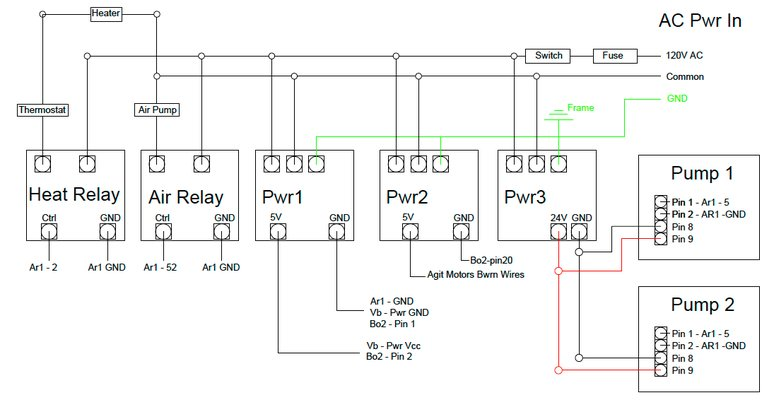 
**Figure 15.** Electric power scheme.

 
**Figure 16.** Arduino 1 (main control board) wiring scheme.

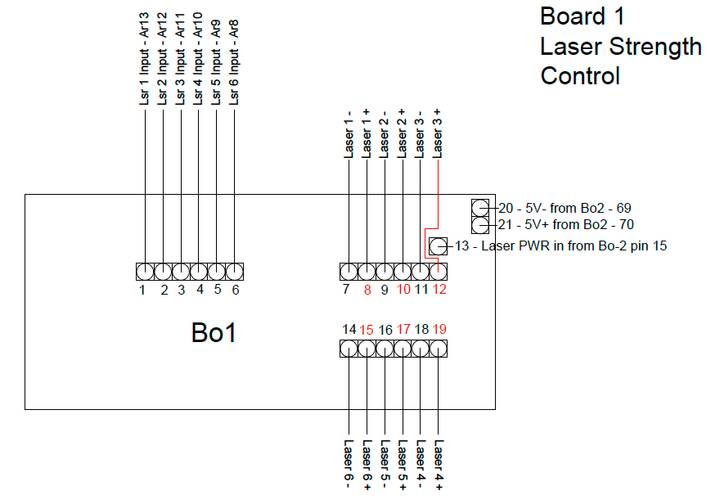 
**Figure 17.** Wiring scheme for laser control board 1.

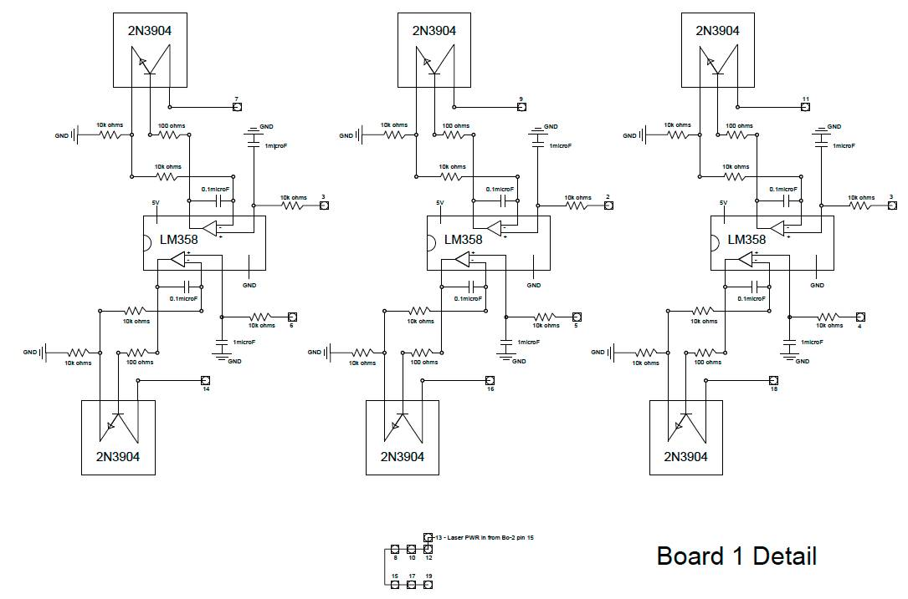 
**Figure 18.** Electrical scheme for laser control board 1.

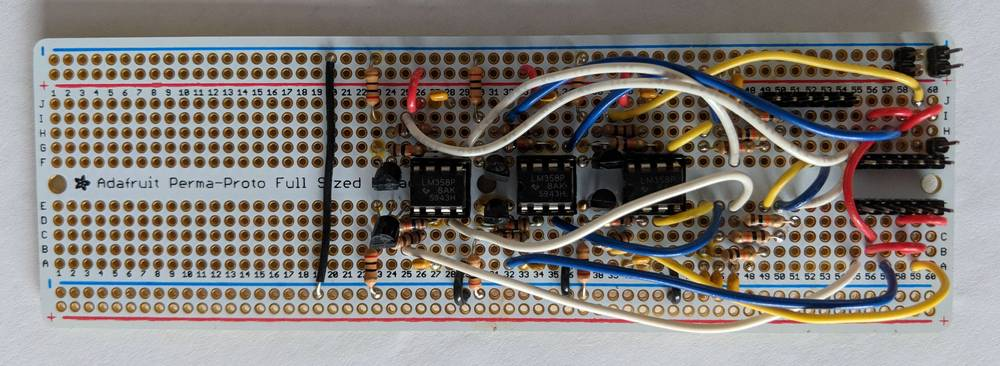 
**Figure 19.** Assembled laser control board 1.

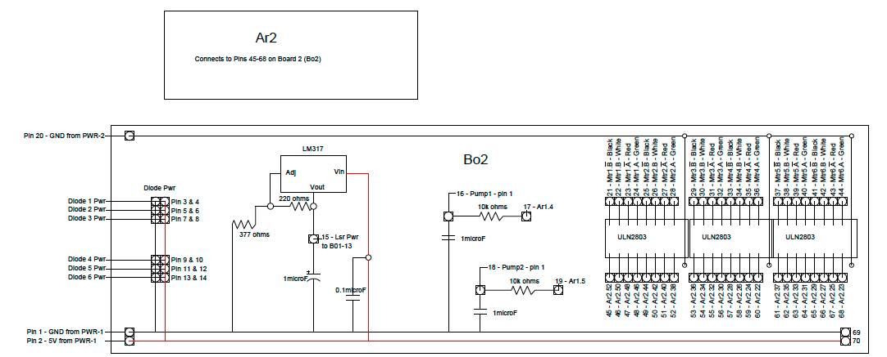 
**Figure 20.** Board 2 is responsible for stirring motors control, powering photodetectors and cleaning the pump control signal.

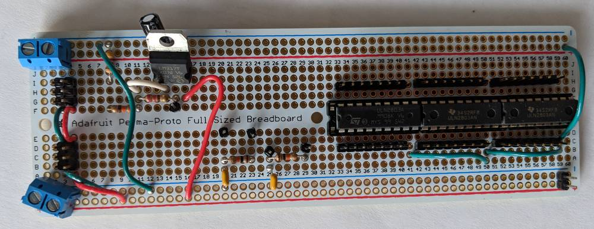 
**Figure 21.** Assembled control board 2.

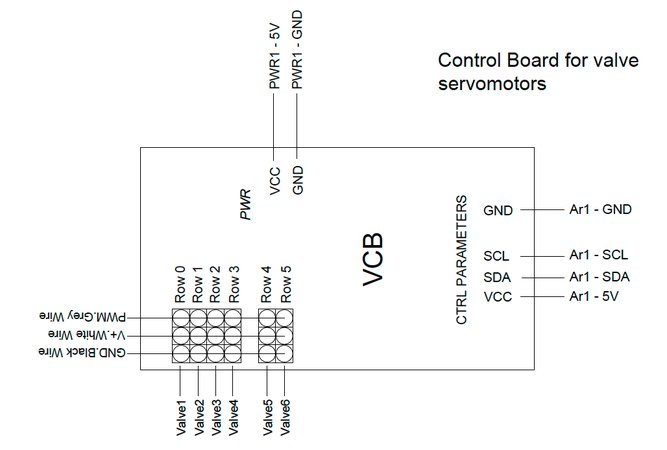 
**Figure 22.** Wiring of the servo motor control board.

## 5. 3D-printing

All 3-D printed parts were made with ABS plastic except for the "O-ring" and “Laser gasket” that were made with bridge nylon

3D Printer used - Lulzbot Taz 5

Water soluble Elmers glue was used on the base of the bed during nylon prints

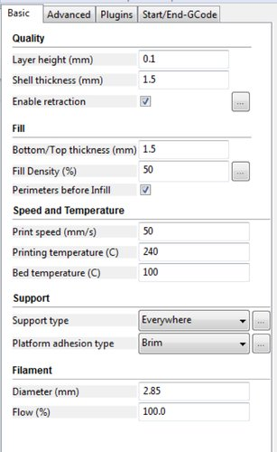 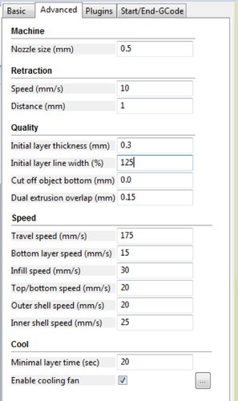 
**Figure 23.** Parameters for 3D printer.

### 5.1 STL files
STL files for printing custom parts for Morbidostat are located in `3D_printing` folder.

- `DiodeMount.stl` - Photodiode case.
- `LaserGasket.stl` - Gasket used for the laser positioning inside the case.
- `LaserHolder.stl` - Laser case.
- `MagnetHolder.stl` - A cap for stepper motors with the places for magnets.
- `TestTubeHolder.stl` - Reactor tube holder.
- `TopTubeGasket.stl` - O-ring for reactor stabilization.
- `Valve.stl` - Valve bracket that holds servo motors and tubing.
- `ValveLever.stl` - Oval lever for servo motors. It pushes wedges that close tubing.
- `ValveWedge.stl` - Wedges for tube closing.

## 6. Assembled morbidostat

Morbidostat was assembled in the custom-made box equipped with thermostat, web-camera and air pump.

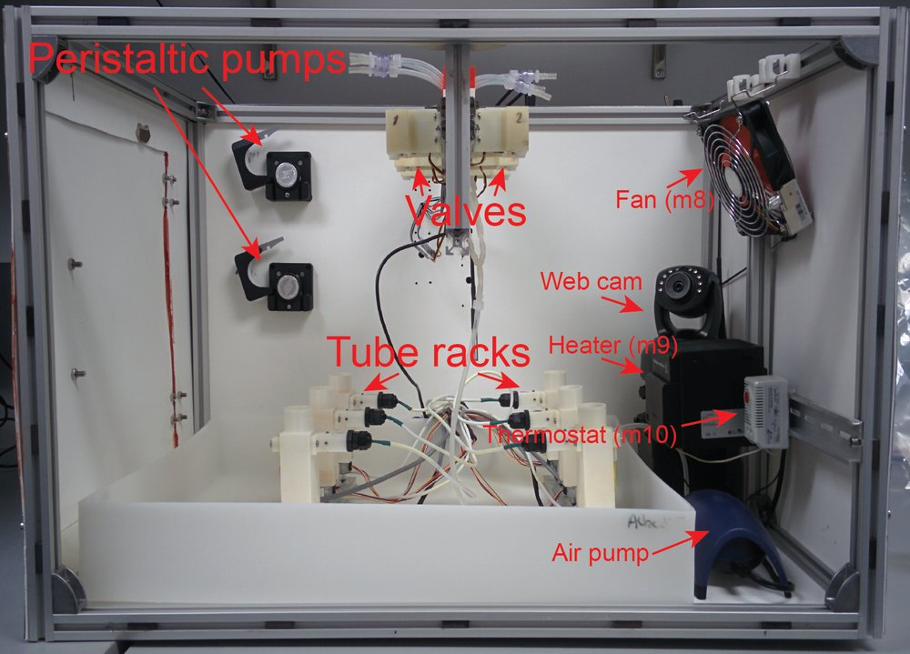 
**Figure 24.** Morbidostat. Side view.

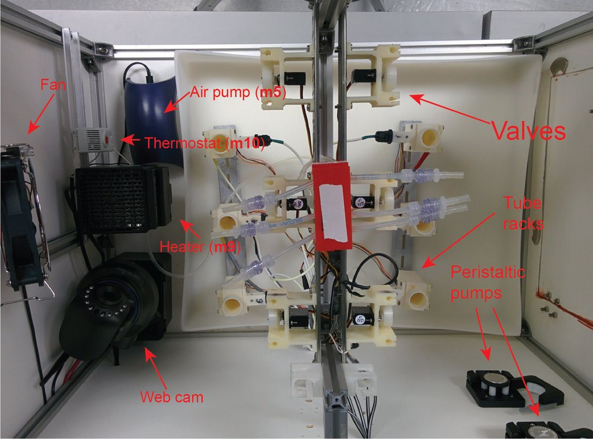 
**Figure 25.** Morbidostat. View form above.
