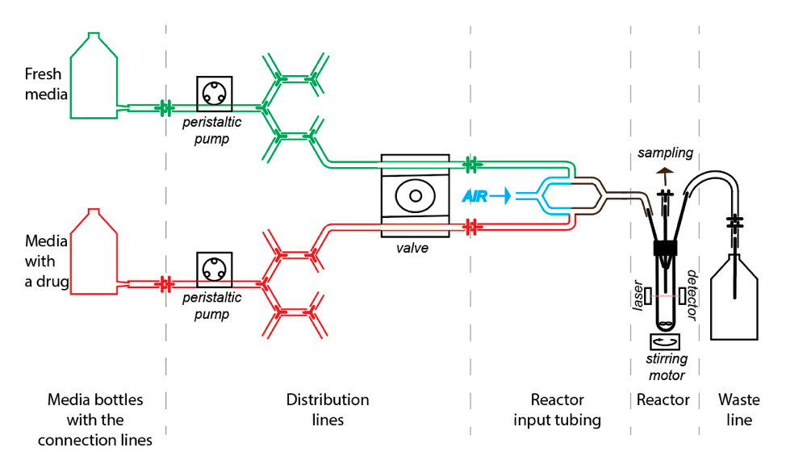
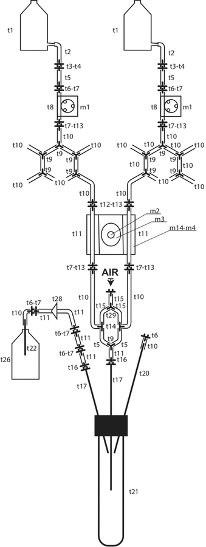
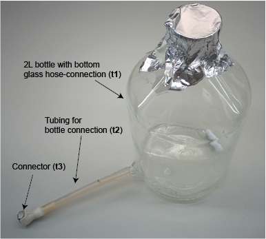
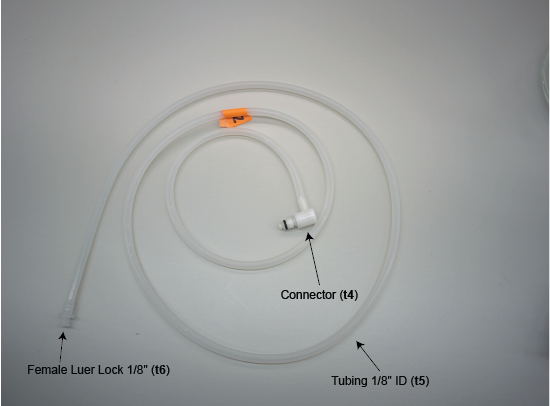
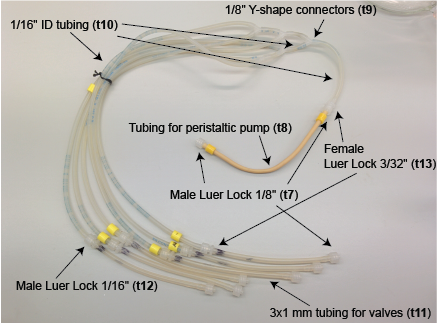
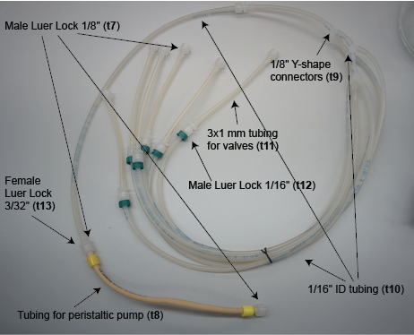
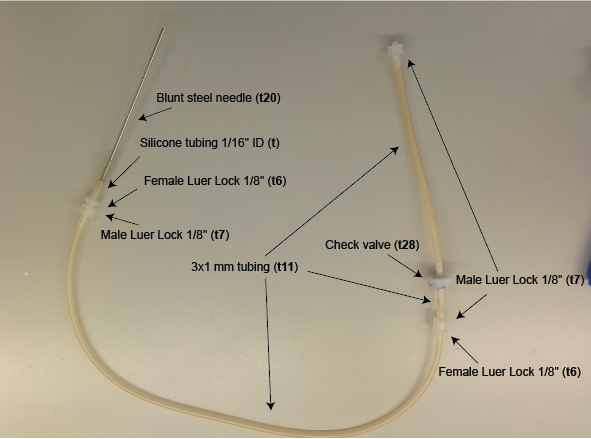

# Morbidostat construction
Building Osterman Lab implementation of morbidostat.

## 1. General principles
We constructed our morbidostat based on the same principles that were described in the [Toprac et al. paper][link1]. In short:  
1)	Optical density of the culture in the reactor is measured every fixed time.  
2)	At the time when the software should initiate dilution the current optical density (OD1) is compared with two values: Upper threshold (UT) and previous optical density (OD0).  
3)	If OD1 ≥ UT and OD1-OD0 ≥ 0 the dilution is made with the drug media.  
4)	Else the fresh media is added

We introduced a new feature - **the lower threshold (LT)**. If OD1 < LT then morbidostat dilutes the culture in the reactor once in hour with the fresh media. LT used:  
1. to allow to start the run on the very low initial OD and to enable active dilution at the same OD for all reactors;  
2. to prevent wash out of the culture during the run.

Dilution by fresh media below the LT once per hour helps to avoid reactor drying during long “sleeping” phase and to decrease residual drug concentration without wash out of the culture.

## 2. Fluidics
Morbidostat has five types of the tubing parts:
1.	**Media bottles with the connection lines** – store drug-containing and fresh media and connect bottles to the pumps.
2.	**Distribution lines** – distribute media among six reactors. Distribution is controlled by peristaltic pumps and valves. Valve simultaneously close or open both tubes containing fresh and drug media. One valve works for one reactor – six valves total. For the dilution the reactors valve opens and one of the pump controlling fresh or drug-containing media start operating.
3.	**Reactor input tubing** – aeration and dilution media introduction. We united air and media input tubings to allow air to make a dry space between fresh media and culturing media. It was made to avoid backflow of the cultured bacteria to the sterile media bottles. This tubing connected to the needle that has its blunt end in the culturing media to introduce bubbling that increases an aeration.
4.	**Reactor** – glass culture tube. Has three ports: input, sampling and waste. In all three ports blunt needles are inserted into the septa. OD in the reactor is measured by laser that is located in the tube rack. To introduce mixing a small stirring motor with the magnets rotates the bar in the tube.
5.	**Waste line** – open line which leads to the bottle with sodium azide. Waste is removed from the reactor by the air pressure. The line has a check valve that prevents backflow of the waste media from the tubing to the reactor.

 
**Figure 1.** General scheme of the morbidostat tubing. Tubing colors:  
  *green* – fresh media,  *red* – drug-containing media,  *blue* – air.

### 2.1 Detailed tubing description
 
**Figure 3.** Detailed tubing scheme.  
The part numbers are indicated according the supplementary parts specification table.

#### 2.1.1	Media bottles with the connection lines
 
**Figure 3.** Media bottle with tubing.  
Alpha-numeric parts numbers in parenthesis here and further identify components in the parts specification table.

 
**Figure 4.** Connection line.

#### 2.1.2 Distribution lines

 
**Figure 5.** Fresh media distribution line.

 
**Figure 6.** Drug-containing media distribution line. Tubing scheme is the same as for the line on figure 4 but has an additional elongation segment.

#### 2.1.3 Reactor tubing and reactor

 
**Figure 7.** Reactor and reactor tubing.

#### 2.1.4 Waste lines

 
**Figure 8.** Waste line.

### 3.1 Detailed mechanical parts description

[1]: Toprak E, Veres A, Yildiz S, Pedraza JM, Chait R, Paulsson J, Kishony R: Building a morbidostat: an automated continuous-culture device for studying bacterial drug resistance under dynamically sustained drug inhibition. Nat Protoc 2013, 8(3):555-567.  
DOI: [10.1038/nprot.nprot.2013.021](10.1038/nprot.nprot.2013.021)
