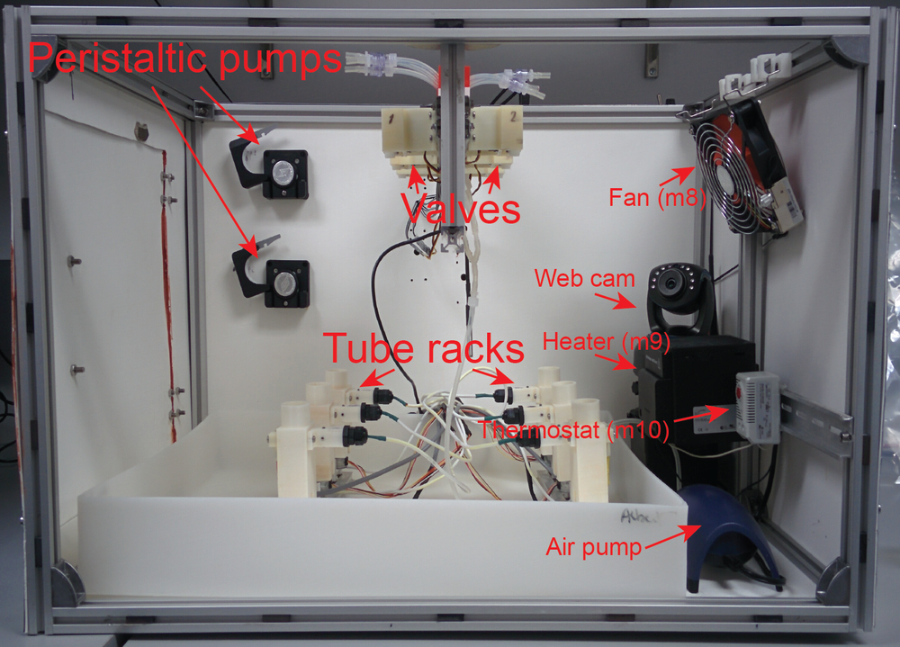
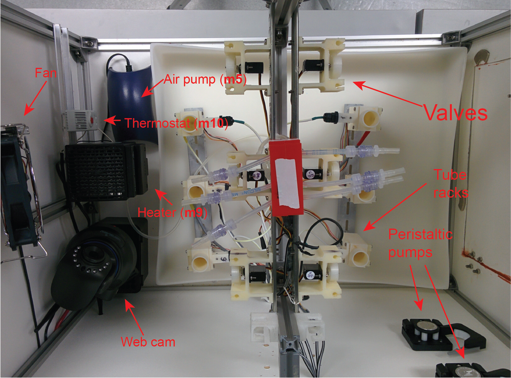

# Morbidostat construction
Building Osterman Lab implementation of morbidostat.

Detailed description of morbidostat components:
1. [Hardware](./Hardware.md)
2. [Software](./Software.md)
3. [Standard operating procedures](./SOP.md)
4. [Spreadsheet with componets specifications](./aux_files/components.xlsx)

## General principles
We constructed our morbidostat based on the same principles that were described in the Toprak et al. paper <a href='#link1'>[1]</a>. In short:  
1)	Optical density of the culture in the reactor is measured every fixed time.  
2)	At the time when the software should initiate dilution the current optical density (OD1) is compared with two values: Upper threshold (UT) and previous optical density (OD0).  
3)	If OD1 ≥ UT and OD1-OD0 ≥ 0 the dilution is made with the drug media.  
4)	Else the fresh media is added

We introduced a new feature - **the lower threshold (LT)**. If OD1 < LT then morbidostat dilutes the culture in the reactor once in hour with the fresh media. LT used:  
1. to allow to start the run on the very low initial OD and to enable active dilution at the same OD for all reactors;  
2. to prevent wash out of the culture during the run.

Dilution by fresh media below the LT once per hour helps to avoid reactor drying during long “sleeping” phase and to decrease residual drug concentration without wash out of the culture.

## Assembled Morbidostat

Morbidostat was assembled in the custom-made box equipped with thermostat, web-camera and air pump.

 
**Figure 1.** Morbidostat. Side view.

 
**Figure 2.** Morbidostat. View form above.

## References

[1]: Toprak E, Veres A, Yildiz S, Pedraza JM, Chait R, Paulsson J, Kishony R: Building a morbidostat: an automated continuous-culture device for studying bacterial drug resistance under dynamically sustained drug inhibition. Nat Protoc 2013, 8(3):555-567.  
DOI: [10.1038/nprot.nprot.2013.021](http://dx.doi.org/10.1038/nprot.nprot.2013.021)
