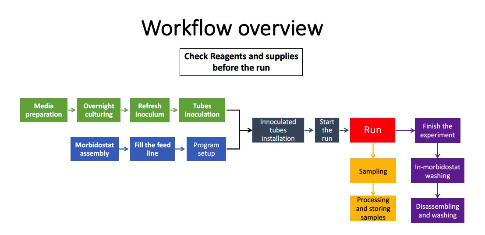

#### [<Back](./README.md)

# Standard operating procedures

**Figure 1.** Morbidostat run procedure scheme.

# Table of contents

- [Calibration](#sop1)
- [Morbidostat assembly](#sop2)
- [Filling of the feed lines](#sop3)
- [Program setup](#sop4)
- [Innoculated tubes installation](#sop5)
- [Start of the run](#sop6)
- [Sampling](#sop7)
- [Processing and storing samples](#sop8)
- [Finish the experiment](#sop9)
- [In-morbidostat washing after a run](#sop10)
- [Disassembling and washing](#sop11)

### Calibration

We used BaCl2 suspension as calibration standards.
1.	Prepare:
  -	150 ml 1% H2SO4
  -	5 ml 1% BaCl2
  -	6 culture tubes with screw caps identical with those used for reactors
2.	Prepare 25 ml of standards based on the table:
McFarland

| goal (McFarland) | 1% BaCl2 (uL) | 1% H2SO4 (ml) |
| ---------------- | ------------- | ------------- |
| 0.25             | 63            | 24.93         |
| 0.5              | 125           | 24.88         |
| 1                | 250           | 24.75         |
| 2                | 500           | 24.50         |
| 3                | 750           | 24.25         |
| 4                | 1000          | 24.00         |

3.	Vortex standards vigorously.
4.	Take aliquots of standards to check McFarland and OD600 values on the McFarland densitometer and spectrophotometer.
5.	Mark true values on the upper part of the tubes.
6.  Measure values on warmed morbidostat and make linear regression TrueValue (Od or MF) ~ log(Mesurement). The R^2 should be more then 0.97.
7.  Type values in the Calibration tab of Software.

### Morbidostat assembly

1. Check if all valves are open. If not – rotate step motors into the open position.
2. Check if all wedges are open and allow free installation of the tubing into the valves. If not – use any thin instrument to move them (like a paper clip).
3.	Install pump 1 distribution line in the peristaltic pump. Don’t close the peristaltic pump.
4.	Install pump 1 distribution line in the valves.
5.	Do the same for the pump 2.
6.	Connect media connection lines. Pull peristaltic pump tubing to the position when stopper touch the pump case.
7.	Close peristaltic pumps.
8.	Install new air filters to the air entrance of the reactor cap tubing.
9.	Install reactors in the rack.
10.	Connect tubing, media distribution lines and air lines.
11.	Connect media bottles to the media connection lines.
12.	Add 20 ml of 5% sodium azide to the waste bottles.
13.	Connect waste lines to the reactors.
14.	Connect waste lines to the waste bottles.
15.	Turn on Morbidostat.

### Filling of the feed lines
First fill line with a Pump 2 media (with a drug). Then Fill line with Pump 1 media and wash feed needle with no drug media.

1.	On the Connection Manager tab connect to the Morbidostat.
2.	On the Settings tab do check/un-check for all valves to be sure that valves are closed.
3.	On the same tab open valve 1 by checking corresponding On/Off check-box.
4.	On the same tab  start pump 2 by checking Pump 2 On/Off check-box.
5.	Stop Pump 2 manually by un-checking Pump 2 On/Off check-box after media will fill the tubing.
6.	Close valve by un-checking corresponding On/Off check-box
7.	Repeat 3-6 for other reactors.
8.	In the Morbidostat Software on the Control tab check all tubes that are in experiment.
9.	On the Settings tab set for all reactors:
  -	Cycle time = 2 min
  -	Dilution time = 16 s
  -	Air pump = checked (On)
  -	Air Delay = -1 (No turning off of Air during pumping)
  -	For Cleaning = Pump1
10.	On the Control tab turn on OD Reading and Automatic Dilution.
11.	Wait for 2 washing cycles and click on Off button for Automatic Dilution and OD Reading at the end of the second cycle.

### Program setup

1.	On the Connection Manager tab connect to the Morbidostat and Agitation boards.
2.	On the Control tab:
  -	Check all tubes that are in the experiment.
  -	Set temperature (Standard = 37°C).
  -	While waiting for inoculated tubes turn on Temperature Control to warm optics.
3.	On the Settings tab:
  -	Set Lower Dilution thresholds (Standard = 0.15. Will be adjusted on the start).
  -	Set Upper Dilution thresholds (Standard = 0.3. Will be adjusted on the start).
  -	Cycle time (in minutes) (Standard = 15).
  -	Dilution time (in seconds) (Standard = 16 sec). 1sec = 0.3ml of added media.
  -	Laser strength should be the same as it was during calibration.
  -	Air Delay (Standard = 5 sec).
  -	Set For Cleaning = None.
4.	On the Message Logger tabs set log files for OD and Pump logs. Be sure that in the time settings menu “Include date” and “Include time” are checked.
5.  Close all lids.

### Innoculated tubes installation

1.	Put O-rings on the inoculated tubes.
2.	Open all morbidostat lids.
3.	Start from distant tubes. Rotate a reactor tube (NOT a cap) to unscrew it.
4.	Take off a cap. Be sure that needles do not touch anything. If necessary lift needles.
5.	Replace tube with inoculated one.
6.	Screw tube by rotating it (NOT a cap).
7.	Seal the O-ring on the rack and check that tube is touching the bottom of the rack.
8.	Repeat steps 4-7 for all reactors.
9.	Slightly burn all upper parts of the needles with a burner.
10.	Adjust needles:
  -	Set waste needle ~2 mm above the liquid surface.
  -	Set input needle tip under the surface ~15 mm lower than waste needle.
  -	Set sample needle above laser. Tip: Top of sample needle should be ~20mm above a top of the waste needle.
11.	Close all lids.

### Start of the run

1.	On the Control tab turn on:
  -	OD Reading
  -	Temperature Control (if it was not already turned on)
2.	On the Settings tab turn on:
  -	Air.
3.	On the Agitation tab turn on:
  -	Agitation.
4.	Wait ~20 min to warm optics.
5.	Get current OD from the Optical Density plot and count it as zero OD.
6.	On the Settings tab adjust Lower Dilution and Upper Dilution thresholds by adding current OD.
7.	**IMPORTANT:** Turn on logging for OD and pumps on the Message Logger tabs.
8.	On the Control tab turn on:
  -	Automatic Dilutions
9.	Visually check system integrity (air bubbling, liquid levels, OD plots, temperature) after first dilution.

### Sampling

1.	Have ready sterile Pump 1 media for dilution at 37°C
2.	Prepare 6x15 mL falcons marked with sample names (containing reactor number and time point ID), 10 mL syringes
3.	Stop air, OD reading, dilution on software tab
4.	Take samples, one by one, from each reactor:
  -	Flame and lower the sampling needle; aspirate 10 mL in syringe, dispense to respective 15 mL tube;
  -	Take 10 mL Pump 1 media, inject into the same port
  -	Leave syringe in place, lift the needle, tape over the syringe (to avoid displacement)
  -	Repeat for all reactors that you want to sample
5.	Check all levels, turn on air, check bubbling
6.	Close box, turn on reading, check values;
7.	If OK, turn on dilution.

###	Processing and storing samples

1.	Glycerol stocks:
  -	Prepare 6 sterile Eppendorf tubes, dispense 300 µL of 50% glycerol each
  -	To each – add 600 µL from each sample, mark on top 1B, 2B…. 6B or whatever letter   corresponding to sampling cycle.
  -	Mix, spin down, freeze in liquid N2, put in -80 box
2.	Cell pellets (for genomic DNA):
  -	Spin remaining samples (~ 9.4 mL) in Beckman: RPM=4,000; Time = 7 min; Temp= 10°C
  -	Remove supernatant: pour off the majority and use 1 mL pipettor to aspirate remainder   (alternatively use vacuum aspiration)
  -	Resuspend each pellet in 10 mL saline: Resuspend using 1 mL pipette to pull sample up   and down until uniform and no chunks are present (vortex is much less effective)
  -	Spin again, same parameters
  -	Remove supernatant, resuspend in 5 mL each (washing step, optional)
  -	Variation – make one or two duplicate aliquots.  
  -	Spin, resuspend by pipette in 1.5 mL (for one aliquot);  [option -   in 3 mL (to split between two tubes, depends on the number of cells and importance)]
  -	Transfer to color-coded (by cycle) 2 mL Eppendorf, label on top
  -	Spin in microcentrifuge (5 min, 14,000)
  -	Remove super, freeze pellets in in liquid N2, put in -80 box

###	Finish the experiment

1.	On the Settings tab turn off:
  -	Air
2.	On the Control tab turn off:
  -	OD Reading
  -	Automatic Dilutions
  -	Temperature Control
3.	Take last samples (Look in the sampling protocol).
4.	On the Agitation turn off:
  -	Agitation

###	In-morbidostat washing after a run

1.	Prepare
  -	~300 ml of 10% bleach in a bottle.
  -	~300 ml of 20% ethanol in a bottle.
  -	Two tubing ~30 cm with female luer connectors
2.	Disconnect media bottles, save residual media if needed and bring it for washing.
3.	Disconnect media connection tubing part before both peristaltic pumps.
4.	Connect the bottle with the fresh bleach to both peristaltic pumps with any tubing. Close all morbidostat lids to decrease bleach odor.
5.	In the Morbidostat Software on the Settings tab set for all reactors:
  -	Cycle time = 2 min
  -	Dilution time = 16 s
  -	Air pump = checked (On)
  -	Air Delay = -1 (No turning off of Air during pumping)
  -	For Cleaning = Pump1
6.	In the Morbidostat Software on the Control tab check all the tubes and set:
  -	OD Reading = ON
  -	Automatic Dilutions = ON
7.	Wait 5 minutes.
8.	Set Automatic Dilutions = OFF. Wait until program is finished (The green indicator near Automatic Dilution become blank).
9.	In the Morbidostat Software on the Settings tab set For Cleaning = Pump2
10.	Redo steps 6-8.
11.	Wait 10 minutes.
12.	Switch the bleach bottle with the ethanol bottle.
13.	Redo steps 5-11.
14.	Disconnect ethanol bottle and leave pumps tubing disconnected.
15.	Redo steps 5-11 to empty feed lines.
16.	Turn off OD reading and Air in the Software and then turn off Morbidostat power switch.

###	Disassembling and washing

1.	Prepare:
  -	The plastic tray.
  -	50ml falcon with 10% bleach (Use the leftovers from the bleach bottle).
  -	Magnetic stick retriever.
  -	Culture tube holder.
2.	Disassemble waste lines from reactors. Rinse waste lines needles in the bleach. Put them in the tray.
3.	Disconnect all feed distribution lines and air line. Discard air filters.
4.	One by one for each reactor:
  -	Unscrew reactor caps and put it in the tray.
  -	Pour out all liquid from the tube. With the help of the magnetic stick retrieve  - keep stirring bar inside the tube while pouring.
  -	Put the tube on the holder.
5.	Put the tray under feed lines ends.
6.	Open all valves.
7.	Pull out all tubing out of valve holders and put them in the tray.
8.	Open peristaltic pumps.
9.	Pull out the tubing out of the peristaltic pump.
10.	Bring tubing and tubes for washing.
11.	Bring waste bottles to the hood.
12.	Pour bleach to waste bottles in a volume about 10% of waste.
13.	Close Waste bottles to minimize an odor.
14.	Let waste stay for ~30 min.
15.	Pour out waste.
16.	Bring waste bottles to the washing.
17.	Wash everything with soap water and laboratory brush. Then rinse thoroughly with DI-water.
18.	Let everything dry. Water from tubing could be sucked with vacuum.
19.	Assemble reactors and close sample needle with a stopper.
20.	Foil all open connectors and pack everything for autoclaving. **NOTE:** Don’t forget to put stirring bars to reactors and media bottles prior to autoclaving.
21.	Autoclave 30 min on the gravity cycle.
