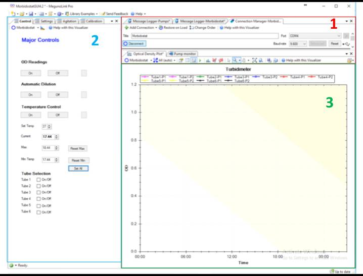
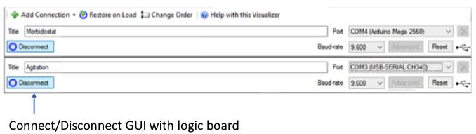
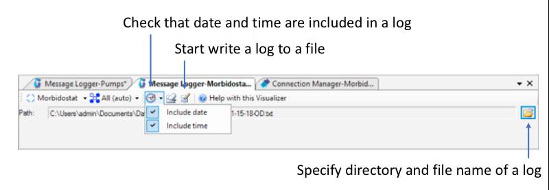
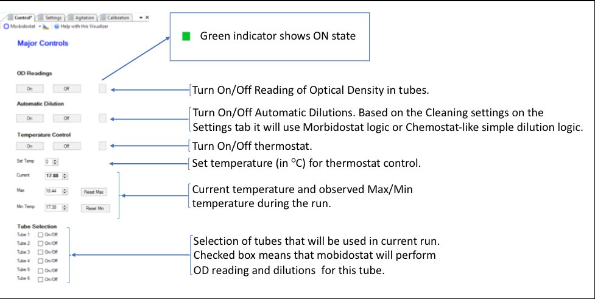
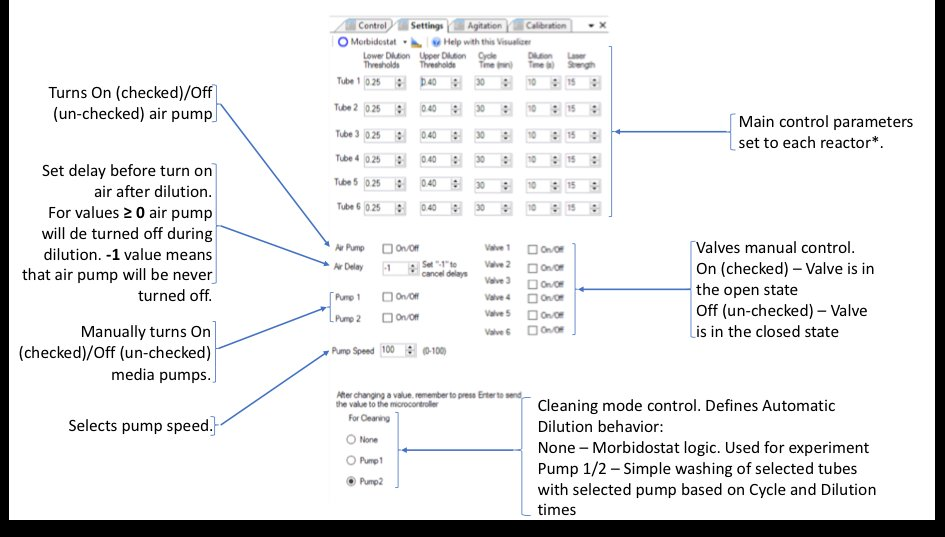
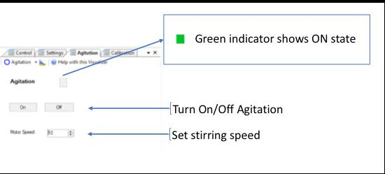
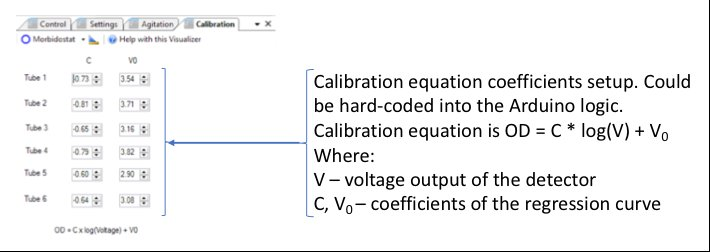
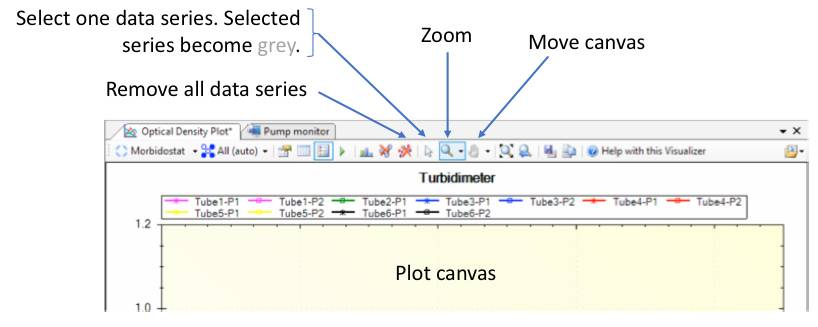
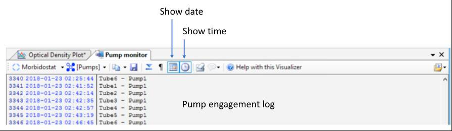

#### [<Back](./README.md)

# Software
The morbidostat control logic implemented on the Arduino programming language. GUI is designed with the [MegunoLink](https://www.megunolink.com/) interface tool.

Main principles of morbidostat logic are described in the  Toprak et al paper <a href='#link1'>[1]</a>.

Code could be found in the `software/v4.2` folder
- `MorbidostatGUI4.2.mlx` - MegunoLink GUI Interface
- `morbidostat2-7-18` - Arduino 1 code (main controls)
- `motorcontrol` - Arduino 2 code (stepper motors control)

## Graphical User Interface
GUI provides an interface to exchange information with Arduino board.

Interface has 3 major sections:
1.	 Connection controls/Logs outputs controls
2.	 Run controls
3.	 Real-time plots/logs from the current run.

### 1. Connection controls/Logs outputs controls
In this part you can control general connection of computer to the morbidostat logic boards and set output log files.

- **Connection manager**

- **Message logger**

### 2. Run controls
In this section you can control morbidostat process (turn on/of OD reading, media pumps, heater, air pump) and set parameters for the run (thresholds, dilution rates, temperature in the chamber, select tubes that are used in the experiment).

- **Control tab**

- **Settings tab**

- **Agitation tab**

- **Calibration**

### 3. Real-time plots/logs from the current run
Sections shows OD plot and log of pumps activations.

- **OD plot**

- **Pump engagement log**

## References

[1]: Toprak E, Veres A, Yildiz S, Pedraza JM, Chait R, Paulsson J, Kishony R: Building a morbidostat: an automated continuous-culture device for studying bacterial drug resistance under dynamically sustained drug inhibition. Nat Protoc 2013, 8(3):555-567.  
DOI: [10.1038/nprot.nprot.2013.021](http://dx.doi.org/10.1038/nprot.nprot.2013.021)
